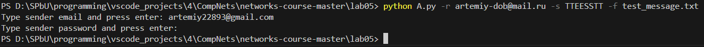
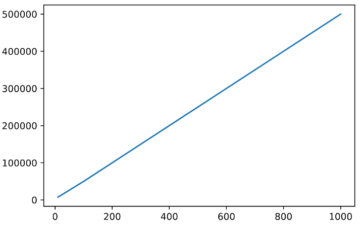
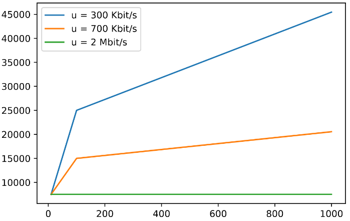

# Практика 5. Прикладной уровень

## Программирование сокетов.

### A. Почта и SMTP (7 баллов)

### 1. Почтовый клиент (2 балла)
Напишите программу для отправки электронной почты получателю, адрес
которого задается параметром. Адрес отправителя может быть постоянным. Программа
должна поддерживать два формата сообщений: **txt** и **html**. Используйте готовые
библиотеки для работы с почтой, т.е. в этом задании **не** предполагается общение с smtp
сервером через сокеты напрямую.

Приложите скриншоты полученных сообщений (для обоих форматов).

#### Демонстрация работы

`python A.py -r <receiver email> -s <subject> -f <file with email body>`

### 2. SMTP-клиент (3 балла)
Разработайте простой почтовый клиент, который отправляет текстовые сообщения
электронной почты произвольному получателю. Программа должна соединиться с
почтовым сервером, используя протокол SMTP, и передать ему сообщение.
Не используйте встроенные методы для отправки почты, которые есть в большинстве
современных платформ. Вместо этого реализуйте свое решение на сокетах с передачей
сообщений почтовому серверу.

Сделайте скриншоты полученных сообщений.

#### Демонстрация работы
todo

### 3. SMTP-клиент: бинарные данные (2 балла)
Модифицируйте ваш SMTP-клиент из предыдущего задания так, чтобы теперь он мог
отправлять письма с изображениями (бинарными данными).

Сделайте скриншот, подтверждающий получение почтового сообщения с картинкой.

#### Демонстрация работы
todo

---

_Многие почтовые серверы используют ssl, что может вызвать трудности при работе с ними из
ваших приложений. Можете использовать для тестов smtp сервер СПбГУ: mail.spbu.ru, 25_

### Б. Удаленный запуск команд (3 балла)
Напишите программу для запуска команд (или приложений) на удаленном хосте с помощью TCP сокетов.

Например, вы можете с клиента дать команду серверу запустить приложение Калькулятор или
Paint (на стороне сервера). Или запустить консольное приложение/утилиту с указанными
параметрами. Однако запущенное приложение **должно** выводить какую-либо информацию на
консоль или передавать свой статус после запуска, который должен быть отправлен обратно
клиенту. Продемонстрируйте работу вашей программы, приложив скриншот.

Например, удаленно запускается команда `ping yandex.ru`. Результат этой команды (запущенной на
сервере) отправляется обратно клиенту.

#### Демонстрация работы
todo

### В. Широковещательная рассылка через UDP (2 балла)
Реализуйте сервер (веб-службу) и клиента с использованием интерфейса Socket API, которая:
- работает по протоколу UDP
- каждую секунду рассылает широковещательно всем клиентам свое текущее время
- клиент службы выводит на консоль сообщаемое ему время

#### Демонстрация работы
todo

## Задачи

### Задача 1 (2 балла)
Рассмотрим короткую, $10$-метровую линию связи, по которой отправитель может передавать
данные со скоростью $150$ бит/с в обоих направлениях. Предположим, что пакеты, содержащие
данные, имеют размер $100000$ бит, а пакеты, содержащие только управляющую информацию
(например, флаг подтверждения или информацию рукопожатия) – $200$ бит. Предположим, что у
нас $10$ параллельных соединений, и каждому предоставлено $1/10$ полосы пропускания канала
связи. Также допустим, что используется протокол HTTP, и предположим, что каждый
загруженный объект имеет размер $100$ Кбит, и что исходный объект содержит $10$ ссылок на другие
объекты того же отправителя. Будем считать, что скорость распространения сигнала равна
скорости света ($300 \cdot 10^6$ м/с).
1. Вычислите общее время, необходимое для получения всех объектов при параллельных
непостоянных HTTP-соединениях
2. Вычислите общее время для постоянных HTTP-соединений. Ожидается ли существенное
преимущество по сравнению со случаем непостоянного соединения?

#### Решение
todo

### Задача 2 (3 балла)
Рассмотрим раздачу файла размером $F = 15$ Гбит $N$ пирам. Сервер имеет скорость отдачи $u_s = 30$
Мбит/с, а каждый узел имеет скорость загрузки $d_i = 2$ Мбит/с и скорость отдачи $u$. Для $N = 10$, $100$
и $1000$ и для $u = 300$ Кбит/с, $700$ Кбит/с и $2$ Мбит/с подготовьте график минимального времени
раздачи для всех сочетаний $N$ и $u$ для вариантов клиент-серверной и одноранговой раздачи.

#### Решение
1. Клиент-серверная раздача. $D_{c-s} \geq max(NF/u_s, F/d_{min})$. От $u$ ничего не зависит,потому смотрим только на N:
   - $N = 10$, $D_{c-s} \geq 7500$ сек
   - $N = 100$, $D_{c-s} \geq 50000$ сек
   - $N = 1000$, $D_{c-s} \geq 500000$ сек
   - 
2. Одноранговая раздача. $D_{P2P} \geq max(F/u_s, F/d_{min}, NF/(u_s + \sum u_i))$. $F/u_s=500$ сек, $F/d_{min}=7500$ сек. Ищем $NF/(u_s + \sum u_i)$
   - $N = 10, u = 300$. $NF/(u_s + \sum u_i) \approx 4535 \implies D_{P2P} \geq 7500$
   - $N = 10, u = 700$. $NF/(u_s + \sum u_i) < 4535$ при $u = 300 \implies D_{P2P} \geq 7500$
   - $N = 10, u = 2000$. $NF/(u_s + \sum u_i) < 4535$ при $u = 300 \implies D_{P2P} \geq 7500$
   - $N = 100, u = 300$. $NF/(u_s + \sum u_i) = 25000 \implies D_{P2P} \geq 25000$
   - $N = 100, u = 700$. $NF/(u_s + \sum u_i) = 15000 \implies D_{P2P} \geq 15000$
   - $N = 100, u = 2000$. $NF/(u_s + \sum u_i) \approx 6522 \implies D_{P2P} \geq 7500$
   - $N = 1000, u = 300$. $NF/(u_s + \sum u_i) \approx 45455 \implies D_{P2P} \geq 45455$
   - $N = 1000, u = 700$. $NF/(u_s + \sum u_i) \approx 20548 \implies D_{P2P} \geq 20548$
   - $N = 1000, u = 2000$. $NF/(u_s + \sum u_i) \approx 7389 \implies D_{P2P} \geq 7500$
   - 

### Задача 3 (3 балла)
Рассмотрим клиент-серверную раздачу файла размером $F$ бит $N$ пирам, при которой сервер
способен отдавать одновременно данные множеству пиров – каждому с различной скоростью,
но общая скорость отдачи при этом не превышает значения $u_s$. Схема раздачи непрерывная.
1. Предположим, что $\dfrac{u_s}{N} \le d_{min}$.
   При какой схеме общее время раздачи будет составлять $\dfrac{N F}{u_s}$?
2. Предположим, что $\dfrac{u_s}{N} \ge d_{min}$. 
   При какой схеме общее время раздачи будет составлять  $\dfrac{F}{d_{min}}$?
3. Докажите, что минимальное время раздачи описывается формулой $\max\left(\dfrac{N F}{u_s}, \dfrac{F}{d_{min}}\right)$?

#### Решение
1. Если каждому пиру давать данные непрерывно со скоростью $v = \dfrac{u_s}{N}$, то поскольку $\dfrac{u_s}{N} \le d_{min}$, все пиры успеют получить все данные. Каждый пир получит свои данные за время $\dfrac{F}{v} = \dfrac{N F}{u_s}$.
2. Пусть $v = d_{min}$. $\dfrac{u_s}{N} \ge d_{min} \implies Nd_{min} \leq u_s$, значит сервер может отдавать данные таким образом. А поскольку эта скорость минимальная среди всех пиров, то все клиенты успеют получить эти данные. Итого $\dfrac{F}{v} = \dfrac{F}{d_{min}}$
3. Оценка. $v \geq \dfrac{N F}{u_s}$, т.к. серверу надо передать $N F$ данных со скоростью, не большей $u_s$. $v \geq \dfrac{F}{d_{min}}$, т.к. самый медленный клиент со скоростью $d_{min}$ должен получить $F$ данных.
Пример. Если $d_{min} \geq \dfrac{u_s}{N}$, то по пункту 1 мы можем передать все за $\dfrac{N F}{u_s} \geq \dfrac{F}{d_{min}}$, т.е. за максимум из этих двух величин. Если $d_{min} \leq \dfrac{u_s}{N}$, то по пункту 2 мы можем передать все за $\dfrac{F}{d_{min}} \geq \dfrac{N F}{u_s}$, опять же, максимум из этих двух величин. Что и требовалось доказать.